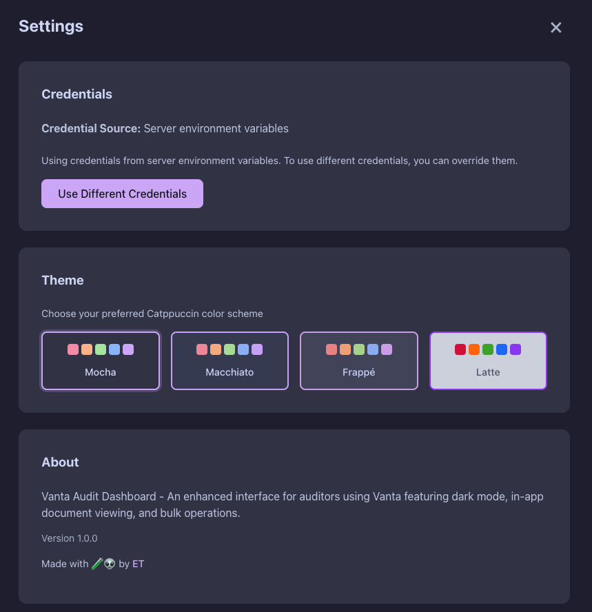
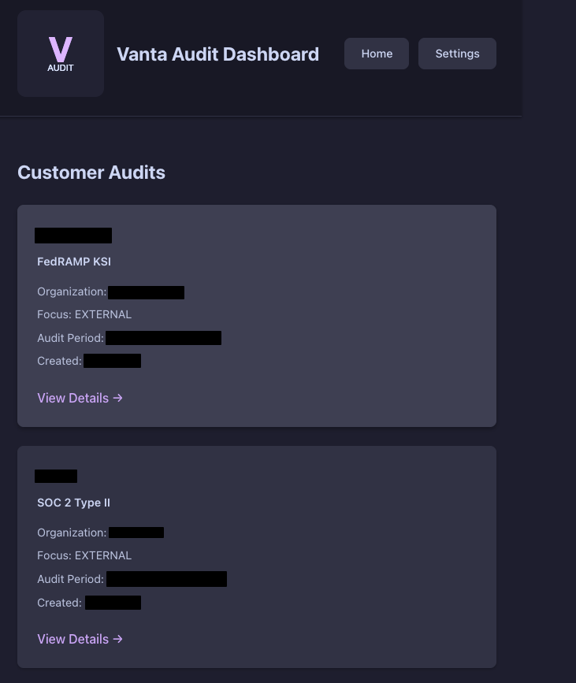
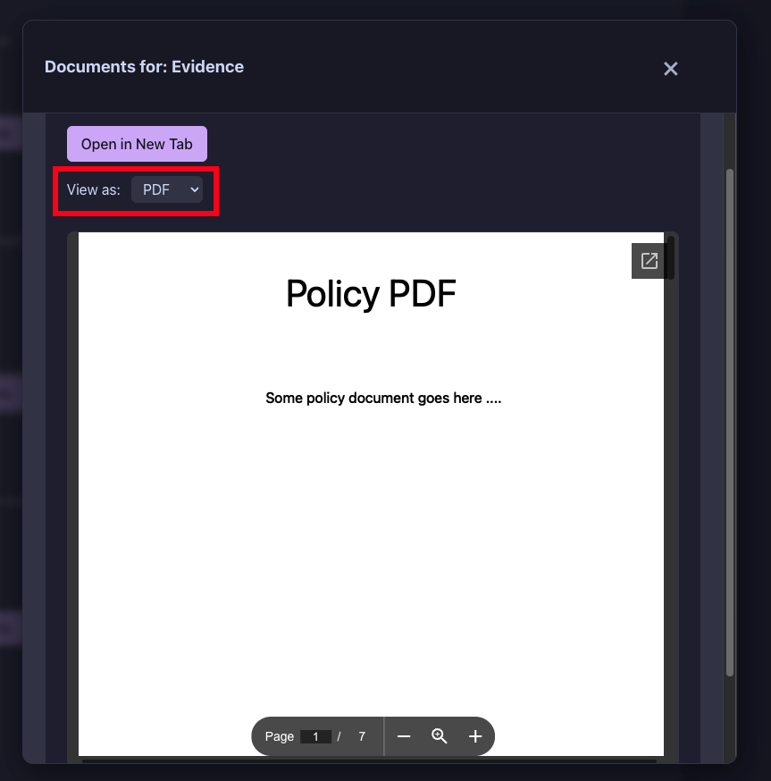
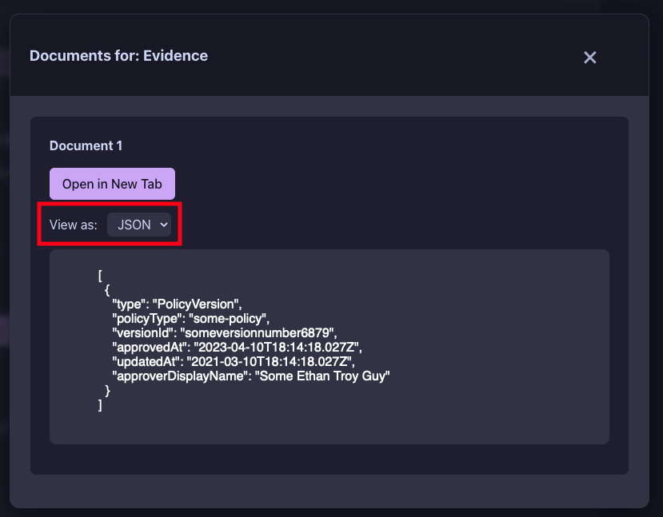
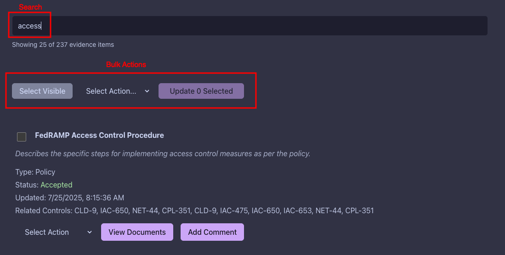
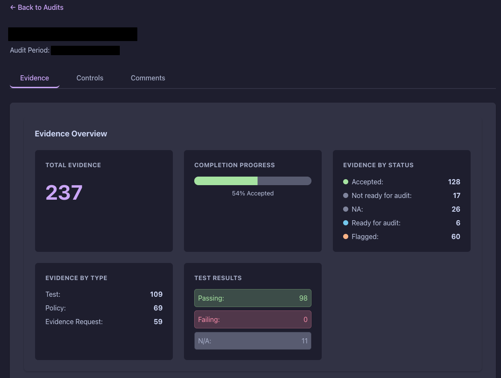

# Vanta Auditor Interface

> [!WARNING]
> **DISCLAIMER**: This is a proof-of-concept (POC) application provided "as is" without warranty of any kind. The author(s) are not responsible for any damages, data loss, security breaches, or other issues that may arise from using this software. Use at your own risk and ensure you comply with all applicable laws, regulations, and Vanta's Terms of Service. This project is not affiliated with or endorsed by Vanta.

This is simply a POC or template that can be used to create a local web app to interface with the Vanta Auditor API. I really just wanted a way to look at evidence without it being opened in another page at first so the pdf/json viewer came first. Hope it helps someone!


## ✨ Features

### Multiple Themes

- All 4 Catppuccin themes (Mocha, Macchiato, Frappé, Latte)



### Audit Overview Section 🔍



### In-App Document Viewer

 - View PDFs and JSON documents without opening new tabs

<p float="left">
  
  
</p>

### Bulk Evidence Operations & Real-Time Search




### Progress Dashboard



### Smart Document Detection
- Automatically detects PDF vs JSON with manual override (kind of...this is still finicky)

## 🚀 Quick Start

### Option 1: Docker (Recommended)

```bash
# Clone the repository
git clone https://github.com/ethanolivertroy/vanta-auditor-interface.git
cd vanta-auditor-interface

# Copy environment example
cp .env.example .env

# Run with Docker Compose
docker-compose up -d
```

Open http://localhost:3000 and enter your Vanta credentials.

### Option 2: Traditional Setup

```bash
# Clone the repository
git clone https://github.com/yourusername/vanta-auditor-interface.git
cd vanta-auditor-interface

# Install dependencies
npm run install:all

# Copy environment example
cp .env.example .env

# Start development servers
npm run dev
```

- Backend: http://localhost:3000
- Frontend: http://localhost:5173

## 📋 Prerequisites

- Node.js 16+ (for traditional setup)
- Docker & Docker Compose (for Docker setup)
- Vanta API credentials (OAuth Client ID & Secret)

## 🔑 Getting Vanta API Credentials

1. Log in to your Vanta account
2. Navigate to **Settings → Developer → API Tokens**
3. Create a new OAuth application
4. Copy the Client ID and Client Secret
5. Either:
   - Add them to your `.env` file, OR
   - Enter them in the UI when prompted (recommended)

## 🎨 Customization

### Environment Variables

Create a `.env` file based on `.env.example`:

```bash
# Optional - Customize the application
VITE_APP_NAME="My Auditor Interface"
VITE_LOGO_URL="/custom-logo.png"
```

### Custom Logo

Replace the logo by either:
1. Setting `VITE_LOGO_URL` in your `.env` file
2. Mounting a custom logo in Docker:
   ```yaml
   volumes:
     - ./my-logo.png:/app/client/public/logo.png
   ```

## 🏗️ Architecture

```
├── client/               # React frontend with Vite
│   ├── src/
│   │   ├── components/   # React components
│   │   ├── utils/        # Utility functions
│   │   └── config.js     # Configuration
│   └── public/           # Static assets
├── server/               # Express.js backend
│   └── index.js          # API server
└── docker-compose.yml    # Docker configuration
```

## 📚 API Endpoints

- `GET /api/audits` - List all audits
- `GET /api/audits/:id/evidence` - Get audit evidence
- `GET /api/audits/:id/controls` - Get audit controls
- `GET /api/audits/:id/comments` - Get audit comments
- `PUT /api/audits/:id/evidence/:evidenceId` - Update evidence state
- `POST /api/audits/:id/evidence/bulk-update` - Bulk update evidence
- `POST /api/audits/:id/evidence/:evidenceId/comments` - Add comment

## 🛡️ Security

- Credentials can be stored in environment variables or entered via UI
- Client-side credential storage uses browser localStorage
- All Vanta API calls are proxied through the backend
- No credentials are ever sent to third parties
- Please don't be dumb with this 😅

## 🐳 Docker Deployment

### Production Build

```bash
docker build -t vanta-auditor-interface .
docker run -d -p 3000:3000 vanta-auditor-interface
```

### Docker Compose with Custom Config

```yaml
version: '3.8'
services:
  vanta-audit:
    image: vanta-auditor-interface
    ports:
      - "3000:3000"
    environment:
      - VITE_APP_NAME=My Company Audits
    volumes:
      - ./custom-logo.png:/app/client/public/logo.png
```

## 🤝 Contributing

Contributions are welcome! Please feel free to submit a Pull Request.

1. Fork the repository
2. Create your feature branch (`git checkout -b feature/AmazingFeature`)
3. Commit your changes (`git commit -m 'Add some AmazingFeature'`)
4. Push to the branch (`git push origin feature/AmazingFeature`)
5. Open a Pull Request

## 📝 License

This project is licensed under the MIT License - see the LICENSE file for details.

## 🙏 Acknowledgments

- Built with [Vanta Auditor API](https://developer.vanta.com/)
- Theme: [Catppuccin](https://github.com/catppuccin/catppuccin)

## 🐛 Troubleshooting

### Common Issues

**Q: I get a 401 error when trying to connect**
- A: Ensure your Vanta API credentials are correct and have the necessary scopes

**Q: Documents won't load in the viewer**
- A: Check CORS settings and ensure the document URLs are accessible

**Q: The app doesn't start**
- A: Make sure ports 3000 (and 5173 for dev) are not in use

### Getting Help

- Check the [Issues](https://github.com/ethanolivertroy/vanta-auditor-interface/issues) page
- Create a new issue with detailed information about your problem

## 🎯 Roadmap-ish

- [ ] Export audit data to CSV/PDF
- [ ] Keyboard shortcuts
- [ ] Multi-account support
- [ ] Advanced filtering options
- [ ] Audit comparison view

---

Made with 🧪👽 by <a href="https://github.com/ethanolivertroy" target="_blank" rel="noopener noreferrer">ET</a>
